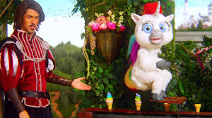

# The Unicorn Kingdom

## Synopsis

A rock opera in another world of wonderful normalcy with an electric new wave sound strack by [Polysics](https://en.wikipedia.org/wiki/Polysics).

A young man wanders through the backdoor of the Manhatten zoo and discovers a hidden gate that has been unlocked. 
Behind it, he finds a magical world of unicorns living in perfect peace and harmony. He is lost, but finds the 
meaning of imagination in his new world.

While travelling through the zoo he meets a zoo keeper with strange hair and a wide collar. Who speaks with koalas

## Cast

- Young Boy: Alice Cooper
- Zookeeper "Speaks with koals": Jack White
- The Unicorn King: Annie Di Franco
- Pizza Delivery Girl: Steve Buschemi
- The Friendly Koala: Billie Joe Armstrong
- The Janitor: Hiroyuki Hayashi

## Notes

Had to strike a deal with the RIAA should be scoring some excellent residuals. 

> Sorry Alan, love you ideas man but, Pete, Morgan, Nick, Tina, Seth, and McCauley are not available. 
> I had to make some changes. 
